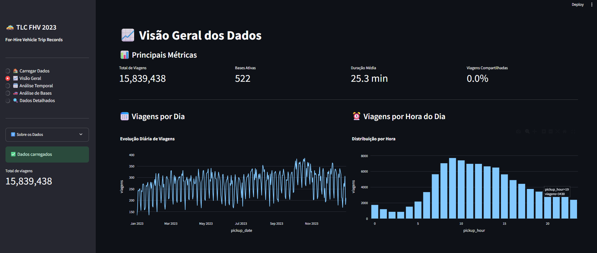

# 📊 TLC FHV 2023 — Dashboard de Análise Exploratória (Streamlit + MinIO)



Este projeto é um dashboard interativo desenvolvido com **Streamlit**, integrado ao **MinIO/S3**, para análise exploratória da base **For-Hire Vehicle Trip Records (FHV)** de **2023** da TLC (NYC Taxi and Limousine Commission).

A aplicação permite carregar milhares/milhões de registros Parquet de forma eficiente, explorá-los com **PyArrow** e visualizar métricas principais, análises temporais, rankings de bases e muito mais.


Baixe os dados em: [https://data.cityofnewyork.us/Transportation/2023-For-Hire-Vehicles-Trip-Data/ywip-y6qr/about_data](https://data.cityofnewyork.us/Transportation/2023-For-Hire-Vehicles-Trip-Data/ywip-y6qr/about_data)
---

## 🚀 Funcionalidades

### **1. Carregamento Inteligente de Dados**
- Leitura direta do MinIO usando `s3fs`  
- Uso de **PyArrow** para performance e baixo consumo de memória  
- Verificação de arquivos Parquet  
- Opções para:
  - pular arquivos com erro  
  - unificar schemas automaticamente  
  - mostrar detalhes do carregamento  
  - carregar quantidade customizada de arquivos  

### **2. Navegação por Múltiplas Páginas**

O dashboard possui **5 seções**:

| Página | Descrição |
|-------|-----------|
| 🏠 **Carregar Dados** | Conexão com MinIO, seleção e leitura dos arquivos Parquet |
| 📈 **Visão Geral** | Métricas principais, gráficos de distribuição e séries temporais |
| 🗓️ **Análise Temporal** | Heatmap, períodos do dia, tendências por hora/dia/semana |
| 🚗 **Análise de Bases** | Ranking de bases, viagens compartilhadas, comparações |
| 🔍 **Dados Detalhados** | Visualização tabular filtrável (em construção) |

---

## 🛠️ Tecnologias Utilizadas

- Python 3.10+  
- Streamlit  
- MinIO + S3FS  
- PyArrow  
- Pandas / NumPy  
- Plotly  
- Docker (opcional)

---

## 📦 Estrutura do Código

```
├── app.py               # Código principal Streamlit
├── README.md
├── requirements.txt
└── docker-compose.yml   # (se estiver usando MinIO e Streamlit via Docker)
```

---

## ⚙️ Como Executar

### **1. Instalar dependências**
```
pip install -r requirements.txt
```

Ou manualmente:
```
pip install streamlit s3fs pyarrow pandas numpy plotly
```

### **2. Configurar variáveis do MinIO**

A aplicação usa automaticamente:

```
MINIO_ENDPOINT=http://minio:9000
MINIO_ROOT_USER=minioadmin
MINIO_ROOT_PASSWORD=minioadmin
```

Você pode sobrescrever:

```
export MINIO_ENDPOINT=http://localhost:9000
export MINIO_ROOT_USER=admin
export MINIO_ROOT_PASSWORD=123456
```

### **3. Executar o dashboard**
```
streamlit run app.py
```

---

## 📁 Estrutura dos Dados (FHV 2023)

Cada arquivo Parquet contém, por padrão:

| Coluna | Descrição |
|--------|-----------|
| dispatching_base_num | Base que despachou a viagem |
| pickup_datetime | Data/hora do início |
| dropoff_datetime | Data/hora do fim |
| PULocationID | Local de pickup |
| DOLocationID | Local de dropoff |
| SR_Flag | Viagem compartilhada |
| affiliated_base_number | Base afiliada |

---

## 📊 Exemplos de Visualizações

- ✔️ Viagens por dia  
- ✔️ Horário de pico  
- ✔️ Duração média das viagens  
- ✔️ Ranking de bases  
- ✔️ Mapa calor por dia/hora (heatmap)

Os gráficos são renderizados dinamicamente via **Plotly**.

---

## 🔧 Recursos Implementados

- Carregamento eficiente com **PyArrow**  
- Suporta **dezenas de milhões de linhas**  
- Leitura em chunks com validação  
- Cache inteligente:
  - `@st.cache_resource` para conexões  
  - `@st.cache_data` para conversões Pandas ↔ Arrow  
- Análise temporal completa:
  - Dia, hora, semana  
  - Períodos do dia (manhã, tarde, noite, madrugada)  
  - Heatmap por dia da semana × hora  

---
Integrantes:

Bernardo Alexander 
Igor Nobre
Pedro Augusto
Pedro Henrique Guimarães
