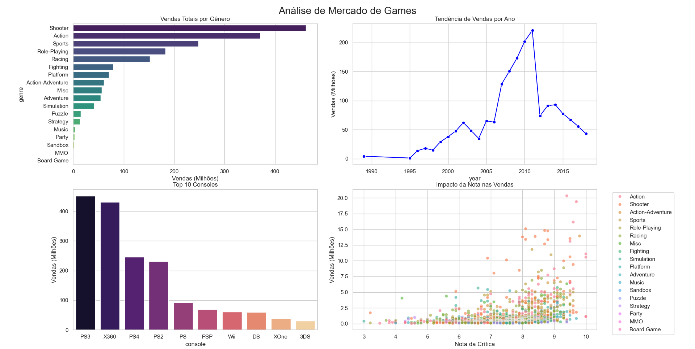

# trabalho_big_data
# 🎮 Análise de Mercado de Videojogos


## 📄 Sobre o Projeto

Este projeto consiste numa análise exploratória de dados (EDA) sobre a indústria de videojogos. O objetivo é identificar padrões de sucesso, tendências de mercado e métricas de desempenho (KPIs) através de dados históricos de vendas.

A análise foca-se em responder a perguntas estratégicas como:
- Quais são os géneros mais lucrativos?
- Como evoluíram as vendas globais ao longo das últimas décadas?
- Qual a correlação entre a crítica especializada e o sucesso comercial?

## 📊 KPIs Analisados

O script processa os dados brutos e gera os seguintes indicadores chave:

| KPI | Resultado | Descrição |
| :--- | :--- | :--- |
| **Vendas Totais** | 1.81 Mil milhões | Volume total de cópias vendidas globalmente. |
| **Melhor Jogo** | GTA V | Título com maior volume individual de vendas. |
| **Género Top** | Shooter | Categoria com maior receita acumulada. |
| **Média Crítica** | 7.54 | Média ponderada das notas dos críticos. |

## 📈 Visualizações e Dashboards

O projeto gera um dashboard visual (`analise_games_dashboard.png`) composto por quatro análises principais:

1.  **Comparação entre Categorias:** Vendas totais divididas por género.
2.  **Série Temporal:** Evolução das vendas ano a ano.
3.  **Agregação por Plataforma:** Top 10 consolas mais populares.
4.  **Correlação:** Gráfico de dispersão entre *Critic Score* e *Total Sales*.

> 

## 🛠 Tecnologias Utilizadas

* **[Python](https://www.python.org/):** Linguagem principal.
* **[Pandas](https://pandas.pydata.org/):** Manipulação e agregação de dados.
* **[Matplotlib](https://matplotlib.org/) & [Seaborn](https://seaborn.pydata.org/):** Criação de gráficos estáticos e estatísticos.

## 🚀 Como Executar o Projeto

### Pré-requisitos

Certifique-se de que tem o Python instalado e as bibliotecas necessárias:

```bash
pip install pandas matplotlib seaborn
