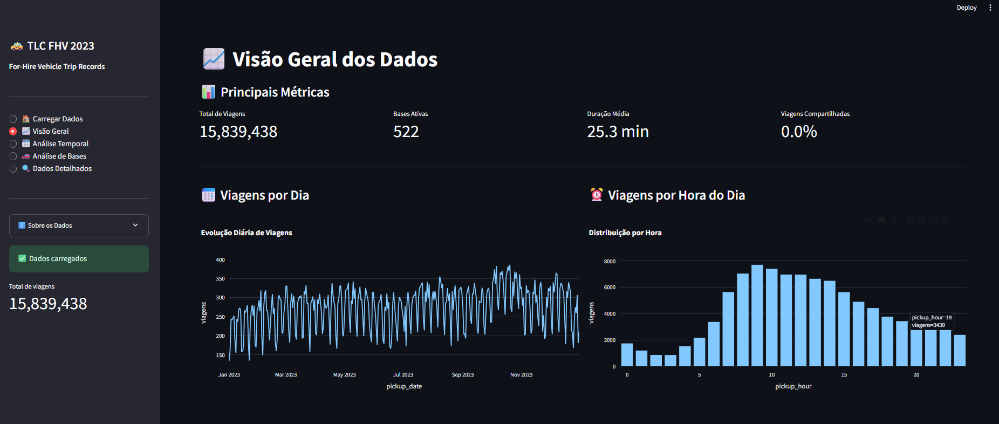

# 🎮 Análise de Vendas de Videogames (1989-2018)
[](.)
[](.)
[](.)
[](.)


## 📋 Visão Geral

Este projeto apresenta uma análise abrangente do mercado global de videogames, cobrindo 29 anos de dados (1989-2018) com **1.210 jogos analisados**. O dataset inclui informações sobre vendas regionais, avaliações críticas, plataformas, gêneros, publishers e desenvolvedores.

## 🎯 Objetivos do Projeto

- Analisar padrões de vendas globais e regionais de videogames
- Identificar os gêneros e publishers mais bem-sucedidos
- Examinar a correlação entre avaliação crítica e sucesso comercial
- Investigar tendências temporais na indústria de games
- Fornecer insights estratégicos para publishers e desenvolvedores

## 📊 Estrutura do Dataset

### Dimensões
- **Total de Registros:** 1.210 jogos
- **Período:** 1989 - 2018
- **Colunas:** 12 variáveis

### Variáveis Disponíveis

| Coluna | Tipo | Descrição |
|--------|------|-----------|
| `Name` | String | Nome do jogo |
| `Platform` | String | Plataforma de lançamento (23 únicas) |
| `Genre` | String | Gênero do jogo (18 categorias) |
| `Publisher` | String | Editora responsável (84 únicas) |
| `Developer` | String | Desenvolvedor (400 únicos) |
| `Critic_Score` | Float | Avaliação da crítica (0-10) |
| `Global_Sales` | Float | Vendas globais (em milhões) |
| `NA_Sales` | Float | Vendas na América do Norte (milhões) |
| `JP_Sales` | Float | Vendas no Japão (milhões) |
| `EU_Sales` | Float | Vendas na Europa (milhões) |
| `Other_Sales` | Float | Vendas em outras regiões (milhões) |
| `Year` | Integer | Ano de lançamento |

## 🔍 Principais Descobertas

### 💰 Vendas Globais

- **Total de Vendas:** 1.815 milhões de cópias
- **Venda Média por Jogo:** 1.50M cópias
- **Mediana de Vendas:** 0.71M cópias
- **Maior Sucesso:** 20.32M cópias

### 🌍 Distribuição Regional

| Região | Vendas (M) | Participação |
|--------|-----------|--------------|
| 🇺🇸 América do Norte | 835.43 | **46.0%** |
| 🇪🇺 Europa | 634.92 | **35.0%** |
| 🌐 Outras Regiões | 215.47 | **11.9%** |
| 🇯🇵 Japão | 128.88 | **7.1%** |

### 🎮 Top 5 Gêneros

1. **Shooter** - 460.97M (25.4%)
2. **Action** - 371.13M (20.5%)
3. **Sports** - 247.92M (13.7%)
4. **Role-Playing** - 182.95M (10.1%)
5. **Racing** - 151.93M (8.4%)

### 🏢 Top 5 Publishers

1. **Activision** - 272.39M
2. **Electronic Arts** - 240.05M
3. **Rockstar Games** - 167.32M
4. **Ubisoft** - 121.05M
5. **EA Sports** - 114.02M

### 📈 Evolução Temporal

- **Pico de Vendas:** 2011 com 220.94M
- **Era de Ouro:** 2007-2011 (vendas >150M/ano)
- **Crescimento:** Expansão contínua até 2011
- **Declínio:** Redução pós-2011 (transição para digital)

### 🔗 Correlações Importantes

| Variáveis | Correlação | Interpretação |
|-----------|-----------|---------------|
| Score × Vendas Globais | 0.370 | Moderada - qualidade ajuda, mas não é tudo |
| NA_Sales × Global_Sales | 0.916 | Muito forte - mercado americano é crucial |
| EU_Sales × Global_Sales | 0.929 | Muito forte - Europa é vital |
| JP_Sales × Global_Sales | 0.264 | Fraca - Japão tem preferências únicas |
| Year × Critic_Score | -0.039 | Nenhuma - qualidade não mudou com tempo |

## 📊 Estatísticas Descritivas

### Vendas Globais
- **Média:** 1.50M
- **Desvio Padrão:** 2.23M
- **Mínimo:** 0.02M
- **Quartil 25%:** 0.35M
- **Mediana:** 0.71M
- **Quartil 75%:** 1.58M
- **Máximo:** 20.32M

### Avaliação Crítica
- **Média:** 7.54/10
- **Desvio Padrão:** 1.20
- **Mínimo:** 3.0/10
- **Máximo:** 10.0/10

## 💡 Insights Estratégicos

### Para Publishers

1. **Foco em Shooters e Action:** Gêneros dominam 46% do mercado
2. **Priorize América do Norte:** Representa quase metade das vendas globais
3. **Não Negligencie Europa:** 35% do mercado é substancial
4. **Marketing é Crucial:** Correlação moderada entre qualidade e vendas indica importância de promoção

### Para Desenvolvedores

1. **Qualidade Importa, Mas Não É Tudo:** Score 7.54 é a média, mas marketing e franquia pesam muito
2. **Diversifique Plataformas:** X360 dominou, mas múltiplas plataformas maximizam alcance
3. **Considere Nichos:** Mercado japonês tem preferências únicas (baixa correlação com global)

### Tendências do Mercado

- **Transição Digital:** Declínio pós-2011 nas vendas físicas não significa declínio do mercado
- **Consolidação:** Top 3 publishers controlam grande fatia do mercado
- **Globalização:** Vendas distribuídas em múltiplas regiões reduzem risco

## 🛠️ Metodologia

### Análise Exploratória
- Estatísticas descritivas completas
- Análise de distribuições e outliers
- Identificação de padrões temporais

### Análise de Correlação
- Matriz de correlação entre variáveis numéricas
- Identificação de relacionamentos lineares
- Análise de interdependência regional

### Análise Comparativa
- Rankings por gênero, publisher e plataforma
- Comparação de performance entre regiões
- Evolução temporal das vendas

## 📁 Estrutura de Arquivos

```
├── data/
│   ├── VideoGames_Vendas.csv
├── docs/
│   ├── relatorio_dashboard.pdf
├── app.py
├── requirements.txt
├── Dockerfile
├── docker-compose.yml
├── imagem.png
└── README.md
```

## ▶️ Como Executar

```
1. Acessar a VM
2. cd /opt/ceub-bigdata/streamlit
3. Ajustar Dockerfile de acordo com o do repositório
4. docker-compose build 
5. docker-compose up -d
```

Acesse em:  
http://localhost:8501

## 📌 Limitações do Dataset

1. **Dados até 2018:** Não inclui tendências recentes de cloud gaming e game pass
2. **Vendas Físicas:** Foco em vendas físicas, sub-representa mercado digital
3. **Críticas Apenas:** Não inclui avaliações de usuários
4. **Seleção de Jogos:** Amostra de 1.210 jogos, não representa mercado completo


## 📚 Referências

- Dataset original: [kaggle]
- Metodologia de análise: Análise exploratória de dados (EDA)
- Ferramentas: Python, Pandas, NumPy, Matplotlib, Seaborn

---
